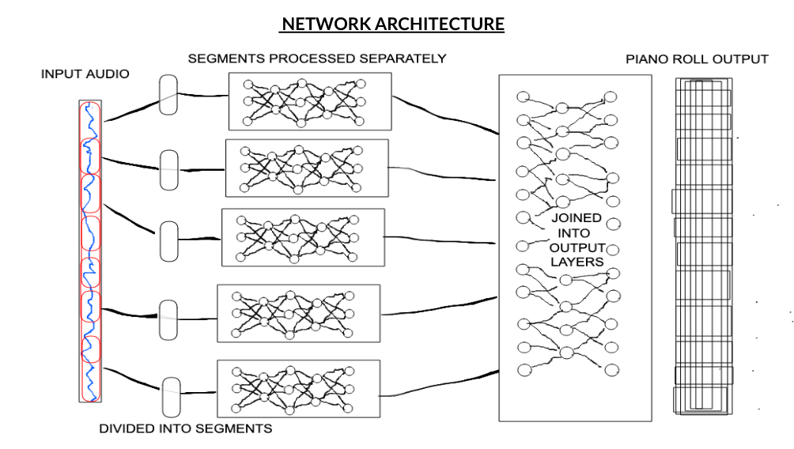
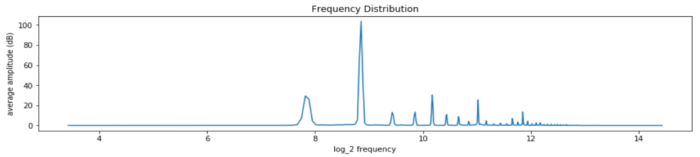
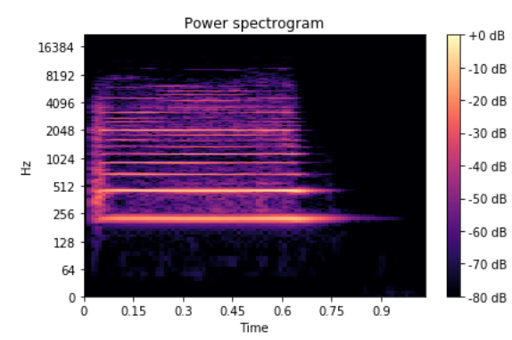
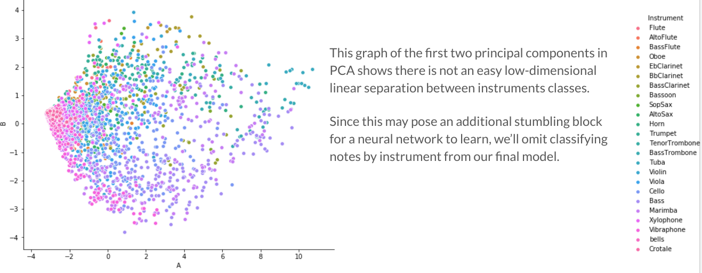
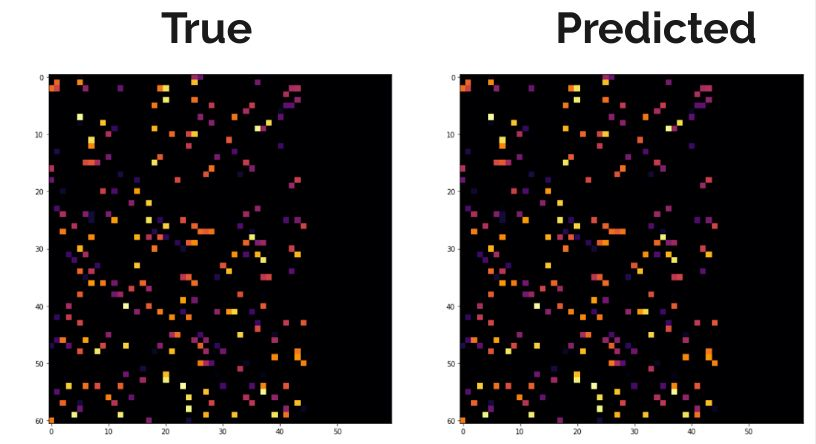

# sound-shift

Automated music transcription using custom TensorFlow 2 deep learning.

### Generating Training Data

Random "compositions" were created by generating piano roll notation, then using this piano roll notation to generate corresponding audio files using samples from [University of Iowa Electronic Music Studios Musical Instrument Sample Database](http://theremin.music.uiowa.edu/MIS-Pitches-2012)

### Network Architecture

Input audio is divided into overlapping 500ms segments, and the STFT with frame length 100ms of these segments is fed into a small network meant to detect instantaneous note attacks (essentially, which notes attacks are going on *right now*). The result of these are combined to form a final piano roll output.

### Why do Fourier Preprocessing?

Although in principle a neural network could learn to isolate pitches without Fourier pre-processing, a spectral representation is more amenable to it, because it turns the problem into a peak-finding exercise. The following images of a (log transformed) STFT and power spectrogram show how the fundamental frequency can be more easily isolated in a spectral representation:

### Limitations

Due to concerns with accurately detecting extended notes and different instruments, we restricted to transcribing marimba, as their percussive attacks are easier to identify (as discovered by previous work), and among pitched percussion instruments we found pitch detection performed best on marimba. The following plot of the first two principal components of samples colored by instrument shows why we chose marimba as our instrument of choice to transcribe instead of opting for instrument detection:

We hope in the future to expand the features we can extract / parse from an input audio file.

In addition, we only tested with notes quantized to a fixed grid. Rhythmic irregularities may throw off note detection. In the future, we hope to integrate note onset detection pre-processing to allow better detection of notes not falling exactly on a quantized grid. 

### Training

Training was completed over the course of a few days on Google Cloud Platform. This was done ad hoc, training parts of the neural network at a time, using single notes at first, then training with examples with more and more complexity once basic single-note detection was sufficiently accurate.

### Reuslts

After training, the network was able to accurately reconstruct both note and intensity information on test data.

Caveat: this should be taken with a grain of salt, since test data was constructed using the same samples and with the same quantization as training data.
